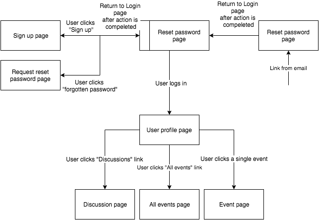

**Welcome to the home of your group's BWA course project code and documentation!**

This file is where your group writes your project plan/project report.

When you write it, you must use Markdown. [Documentation for GitLab Flavored Markdown (GFM)](https://docs.gitlab.com/ee/user/markdown.html).

# Initial project plan document
The headers that must be present in this document are shown here. They were copied here from the course project assignment document.

For instructions on what to add under these headers, see the course project assignment document, [Appendix 2: Initial project plan document](https://docs.google.com/document/d/1iJ4z8dQzUWht0ABX18RXa5Rp8hY76vcMJvBbxODs3PE/edit?usp=sharing#heading=h.m6xhgmo8x8lz)

## Course project group information

Lauri Suomela, 233508, lauri.a.suomela@student.tut.fi
Jani Björklund, 252744, jani.bjorklund@student.tut.fi
Tanjila Akther, 281811, tanjila.akther@student.tut.fi

Group name: Undefined error

Gitlab repo:
    https://course-gitlab.tut.fi/bwa-2018/bwa-group026

Heroku repo:
    https://git.heroku.com/frightening-phantom-16445.git

## Must have features

Tools:
    venv
    CSS&HTML syntax check
    Heroku
    Testing with Debug=false

Features and implementation order:
1. ww 45: Different types of users (normal, site admin)
2. ww 45: User profile pages
3. ww 46: Friendships
4. ww 46: Discussions
5. ww 47: Events

## Planned +2 features

1. ww 46: Using Bootstrap for mobile friendliness
2. ww 47: Reset forgotten password
3. ww 48: Email validation on sign-up
4. ww 48: Thorough testing using Django test

## Pages and navigation

The navigation flow of the site is presented in the image below.

## Technological considerations

### Django apps in your Django project

The main app

### Needed Django models and their attributes

Users:
    Username
    Name
    Email
    Phone number
    Address
    Password
    Friendship requests
    Friendships
    Discussion URLs
    Events
    Status updates

Status updates:
    Time and date posted
    Content
    Messages

Messages:
    Username
    Timestamp
    Content

Discussions:
    Creator
    Creation date
    Participants
    Messages

Events:
    Name
    Starting date
    Duration
    Category
    Description
    Participants
    Messages
    
### URIs

url.com/users/id
url.com/login
url.com/signup
url.com/request_reset
url.com/reset_password
url.com/events/id
url.com/events
url.com/discussion/id

### Needed Django views and templates

    User profile page (url.com/users/id):
        Template:
            real name
            username
            Status updates
            Discussions
            friends
        View:
            This page shows user's page by ID. On this page you can see username always,
            if you're a friend of this person you can also see users friends.
            If you're on your own page, you can see your status updates and discussions
            as well. By clicking discussions, you open the discussion-page. By clicking
            friend's name, you go to their page. By clicking edit you can edit your
            informations.
                
    Login page (url.com/login):
        Template:
            Username field
            Password field
            Recover lost password button
            Sign up button
            login button
        View:
            This page makes it possible to login to the webpage. you fill the login creditials
            and press the login button. If you don't remember the correct password, system
            doesn't let you in and gives you a message of faulty password. You can click
            recover lost password -button if you want to recover your password by creating a
            new one. Clicking it opens a field where you can fill your email where new one
            is sent. On this page there is also Sign up -button which open sign up page
            
    Sign up page (url.com/signup):
        Template:
            Username field
            Name field
            Email field
            Phone number field
            Address field
            Password field
            Register button
        View:
            On this page you can fill all the required information to create an account.
            If the username exists already, the user is declined the registeration until
            the password is changed. When all the necessary fields are filled correctly, user
            can press register button and go to the actual page. No verification by email isn't
            used in this version.
            
    Request reset password page (url.com/request_reset):
        Template:
            Email to send reset link field
            Send reset link button
        View:
            On this page there is a field for email and send reset link -button. By filling
            the field with your email and clicking reset link button, the user gets a link to
            recover the password in their email.
            
    Reset password page (url.com/reset_password/id):
        Template:
            New password field
            Confirm new password field
            Reset button
        View:
            This page is has two simple fields to fill with a new password. These fields MUST
            match. If these fields match, by pressing the reset button the password of the user
            will be changed. Otherwise page doesn't change anything.
            After changing the password, the user is let to the page
        
    Event page (url.com/events/id):
        Template:
            Name
            Description
            Event category
            Duration
            Place
            Attendees
            Attend/don't attend button
            Modify button
        View:
            Thw event page consists of all the information about the event itself.
            Name, description, event category, duration, place and who attends the event.
            If the user is creator of this event, he/she can modify the page by clicking modify
            button. Others don't see this button. All the attendees can be clicked and they're
            taken to the page of that specific user. User can also click to attend the event
            and user's name is then added to the attendees list. By clicking it again, the name is removed from the list.
            
    All events page (url.com/events):
        Template:
            Event names
            Event dates
            Event links
        View:
            This page is a list of all the possible events ordered by datea. By clicking
            the name of the event, the user is taken to the event page.
            
    Discussion page (url.com/discussion/id):
        Template:
            Message box
            Text input field
            Send button
            Delete button
            Leave discussion button
        View:
           ???

### Heroku deployment

Heroku url: https://frightening-phantom-16445.herokuapp.com/

Heroku repository is updated whenever a working function has been made. Repository is updated regardless on every weeks Sunday evening to match the gitlab repository of the group.

Heroku updating is Jani Björklund’s responsibility and he has installed the tools on his computer.

## Testing

Testing will be done using Django test
All members will participate in testing part

## Project timetable and division of work

Timetable is documented in the “must have features”
Division of work:
    Lauri: Different types of users , Events, Email validation on sign-up
    Jani : User profile pages, Using Bootstrap for mobile friendliness,   Reset forgotten password
    Tanjila: Friendships, Discussions
    Thorough testing using Django test” will be done by everyone in the group

>>>
_`The Django project in this repo (bwa2018djangoproject), was created for the groups using Heroku Django Starter Template. The information about it left here for educational purposes. The groups are free to remove this text and all the text below it from this file.`_
# Heroku Django Starter Template

An utterly fantastic project starter template for Django 2.0.

## Features

- Production-ready configuration for Static Files, Database Settings, Gunicorn, etc.
- Enhancements to Django's static file serving functionality via WhiteNoise.
- Latest Python 3.6 runtime environment.

## How to Use

To use this project, follow these steps:

1. Create your working environment.
2. Install Django (`$ pipenv install django`)
3. Create a new project using this template

## Creating Your Project

Using this template to create a new Django app is easy::

    $ django-admin.py startproject --template=https://github.com/heroku/heroku-django-template/archive/master.zip --name=Procfile helloworld

(If this doesn't work on windows, replace `django-admin.py` with `django-admin`)

You can replace ``helloworld`` with your desired project name.

## Deployment to Heroku

    $ git init
    $ git add -A
    $ git commit -m "Initial commit"

    $ heroku create
    $ git push heroku master

    $ heroku run python manage.py migrate

See also, a [ready-made application](https://github.com/heroku/python-getting-started), ready to deploy.

## License: MIT

## Further Reading

- [Gunicorn](https://warehouse.python.org/project/gunicorn/)
- [WhiteNoise](https://warehouse.python.org/project/whitenoise/)
- [dj-database-url](https://warehouse.python.org/project/dj-database-url/)

>>>
